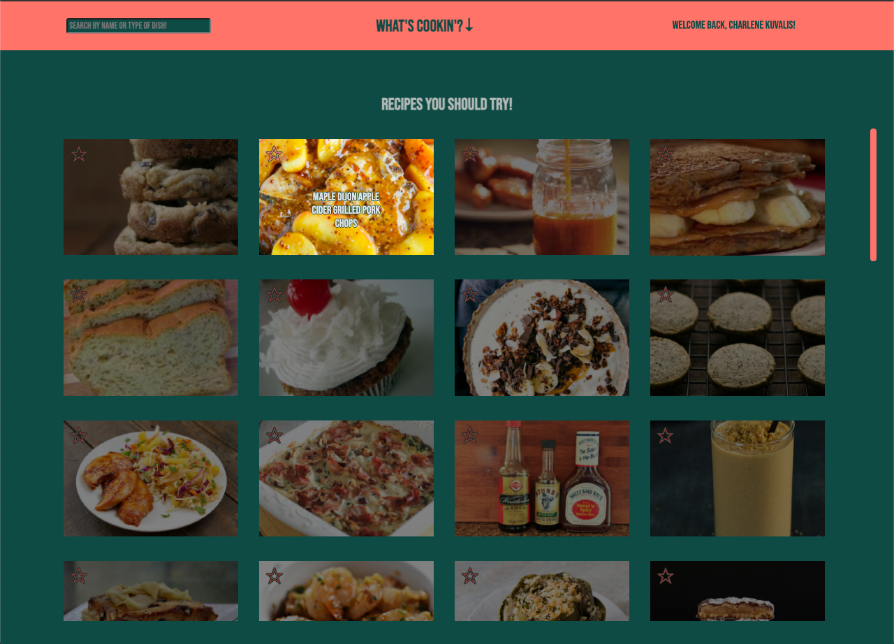
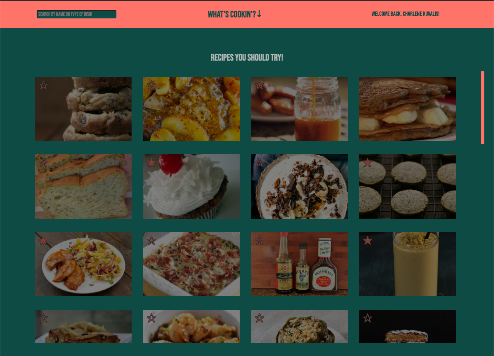
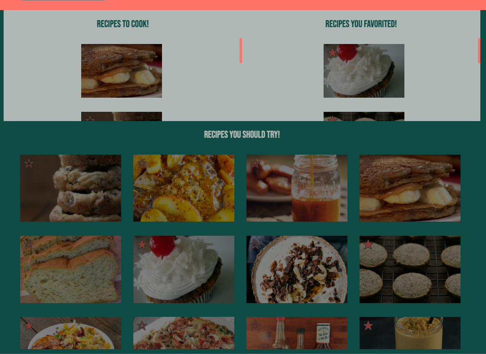

# What's Cookin'

## Contributors

* [Connor Anderson-Larson](https://github.com/ConnorAndersonLarson)
* [Joshua Aragon](https://github.com/josharagon)

## Abstract

What's Cookin' is a recipe website created with a focus on Test Driven Design, multi-class integration, wireframing, and responsive layout. Tests were written and passed before any class integration or DOM manipulation was instituted for each class. While TDD was overall successful, end of sprint time crunches brought about class refactoring and tweaking before tests were rewritten, causing test failures that would need to be remedied after the class was finalized. Wireframing, while minimal, proved helpful in expediting initial site creation. As the project developed further it became clear that a more in depth wireframe is critical for site design ease and speed of implementation. Responsive layout, much like wireframing, was an aspect that began with minimal work focused on it but quickly became an obvious point for initial planning on future projects, as much of the initial design had to be tweaked or reworked to best fit desired responsiveness. Overall the creation of this project, while not complete, has taught invaluable lessons on the importance of framework, TDD, communication, and thorough project planning.

## Technologies Used:

* JavaScript
* CSS
* HTML
* Mocha
* Chai

## Deploy Link:

* [Click here to open What's Cookin' website](https://connorandersonlarson.github.io/whats-cookin-starter-kit/)

## Initial Setup:

* Clone this repo to your computer, run `npm install` for dependencies.
* After opening the project in your text editor run `npm test [filepath]` to run/test classes (as desired).
* Site can be viewed/inspected by running `open src index.html` in your terminal.

## Site Features

* On load all recipes will instantiate and be shown on page to be scrolled through by user.

* When a user hovers over a recipe the image will brighten and the name of the recipe will be displayed.

* As a user checks recipe cards and favorites them the site will reflect the saved recipes.

* When a recipe is clicked it's card will show up, detailing the name, cost, and ingredients on one side while the other shows instructions.

* A user can look at their favorited and saved recipes by clicking the 'What's Cookin' title, where they can then search through their saved recipes using the search bar.

### Future Additions

* Refactor recipe image initialization to reduce load times.
* Increase accessibility.
* Implement Pantry Class to store user ingredients.
* Polish tests with happy/sad testing, incorrect data.
* Ability to remove saved recipes when done cooking.
* Add user class search features to work out of filter.js.
* Redesign layout responsiveness from a mobile-first perspective.
* Add user feature to add their own recipes/ingredients.
* Implement system to show recipes a user can make based on their pantry.
